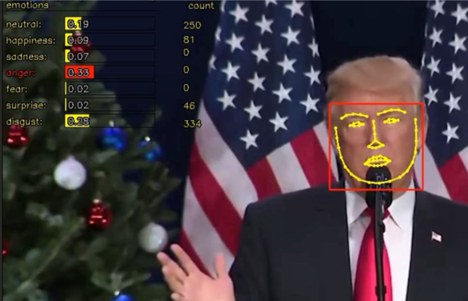

# Detection of Emotions  
비디오로 찍은 얼굴과 감정을 탐지합니다.  

감정 라벨은 총 7가지입니다.  

- Neutral   
- Happiness   
- Sadness   
- Anger  
- Fear  
- Surprise  
- Disgust  

  
**
비디오 감정 분석 결과
**  

# Details on the Implementation
얼굴 검출은 Cascade Detector(Viola-Jones algorithm) 을 기반으로 하며, 감정 감지는 RBF 커널을 사용하는 SVM(Support Vector Machine)을 기반으로 합니다.

# Usage
tsst.py 는 비디오를 탐지 및 테스트 하는데 사용됩니다.  
실제 사용하려면 코드 중간에 있는 경로를 수정하여 사용해야합니다.  
